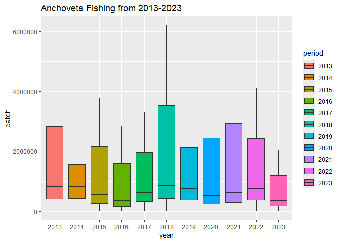

## Instructions
Answer the following questions and/or complete the exercises in RMarkdown. Please embed all of your code and push the final work to your repository. Your report should be organized, clean, and run free from errors. Remember, you must remove the `#` for any included code chunks to run.  

## Load the libraries

``` r
library("tidyverse")
library("janitor")
#library("naniar"). #dont need to install naniar
options(scipen = 999)
```

## About the Data
For this assignment we are going to work with a data set from the [United Nations Food and Agriculture Organization](https://www.fao.org/fishery/en/collection/capture) on world fisheries. These data were downloaded and cleaned using the `fisheries_clean.Rmd` script.  

Load the data `fisheries_clean.csv` as a new object titled `fisheries_clean`.

``` r
fisheries_clean <- read_csv("data/fisheries_clean.csv")
```

1. Explore the data. What are the names of the variables, what are the dimensions, are there any NA's, what are the classes of the variables, etc.? You may use the functions that you prefer.

``` r
glimpse(fisheries_clean)
```

```
## Rows: 1,055,015
## Columns: 9
## $ period          <dbl> 1950, 1951, 1952, 1953, 1954, 1955, 1956, 1957, 1958, …
## $ continent       <chr> "Asia", "Asia", "Asia", "Asia", "Asia", "Asia", "Asia"…
## $ geo_region      <chr> "Southern Asia", "Southern Asia", "Southern Asia", "So…
## $ country         <chr> "Afghanistan", "Afghanistan", "Afghanistan", "Afghanis…
## $ scientific_name <chr> "Osteichthyes", "Osteichthyes", "Osteichthyes", "Ostei…
## $ common_name     <chr> "Freshwater fishes NEI", "Freshwater fishes NEI", "Fre…
## $ taxonomic_code  <chr> "1990XXXXXXXX106", "1990XXXXXXXX106", "1990XXXXXXXX106…
## $ catch           <dbl> 100, 100, 100, 100, 100, 200, 200, 200, 200, 200, 200,…
## $ status          <chr> "A", "A", "A", "A", "A", "A", "A", "A", "A", "A", "A",…
```

2. Convert the following variables to factors: `period`, `continent`, `geo_region`, `country`, `scientific_name`, `common_name`, `taxonomic_code`, and `status`.

``` r
fisheries_fctr <- fisheries_clean %>% 
                  mutate(across(where(is.character), as.factor)) %>% 
                  mutate(period=as.factor(period))
fisheries_fctr
```

```
## # A tibble: 1,055,015 × 9
##    period continent geo_region    country     scientific_name common_name       
##    <fct>  <fct>     <fct>         <fct>       <fct>           <fct>             
##  1 1950   Asia      Southern Asia Afghanistan Osteichthyes    Freshwater fishes…
##  2 1951   Asia      Southern Asia Afghanistan Osteichthyes    Freshwater fishes…
##  3 1952   Asia      Southern Asia Afghanistan Osteichthyes    Freshwater fishes…
##  4 1953   Asia      Southern Asia Afghanistan Osteichthyes    Freshwater fishes…
##  5 1954   Asia      Southern Asia Afghanistan Osteichthyes    Freshwater fishes…
##  6 1955   Asia      Southern Asia Afghanistan Osteichthyes    Freshwater fishes…
##  7 1956   Asia      Southern Asia Afghanistan Osteichthyes    Freshwater fishes…
##  8 1957   Asia      Southern Asia Afghanistan Osteichthyes    Freshwater fishes…
##  9 1958   Asia      Southern Asia Afghanistan Osteichthyes    Freshwater fishes…
## 10 1959   Asia      Southern Asia Afghanistan Osteichthyes    Freshwater fishes…
## # ℹ 1,055,005 more rows
## # ℹ 3 more variables: taxonomic_code <fct>, catch <dbl>, status <fct>
```

3. Are there any missing values in the data? If so, which variables contain missing values and how many are missing for each variable?

``` r
#dont need to do #3, said in class
```

4. How many countries are represented in the data?

``` r
fisheries_fctr %>% 
 group_by(country) %>% 
  distinct(country)
```

```
## # A tibble: 249 × 1
## # Groups:   country [249]
##    country            
##    <fct>              
##  1 Afghanistan        
##  2 Albania            
##  3 Algeria            
##  4 American Samoa     
##  5 Andorra            
##  6 Angola             
##  7 Anguilla           
##  8 Antigua and Barbuda
##  9 Argentina          
## 10 Armenia            
## # ℹ 239 more rows
```

``` r
# As we can see from what the tibble information as well as the groups counter, 249 countries were represented in the data.
```

5. The variables `common_name` and `taxonomic_code` both refer to species. How many unique species are represented in the data based on each of these variables? Are the numbers the same or different?

``` r
fisheries_fctr %>% 
  group_by(common_name) %>% 
  distinct(common_name)
```

```
## # A tibble: 3,390 × 1
## # Groups:   common_name [3,390]
##    common_name            
##    <fct>                  
##  1 Freshwater fishes NEI  
##  2 Crucian carp           
##  3 Common carp            
##  4 Grass carp(=White amur)
##  5 Silver carp            
##  6 Bighead carp           
##  7 Wuchang bream          
##  8 Bleak                  
##  9 Orfe(=Ide)             
## 10 Common dace            
## # ℹ 3,380 more rows
```

``` r
#Their are 3,390 common names representing species in the data
```


``` r
fisheries_fctr %>% 
  group_by(taxonomic_code) %>% 
  distinct(taxonomic_code)
```

```
## # A tibble: 3,722 × 1
## # Groups:   taxonomic_code [3,722]
##    taxonomic_code 
##    <fct>          
##  1 1990XXXXXXXX106
##  2 140014109002   
##  3 140014113401   
##  4 140018102601   
##  5 140018104601   
##  6 140018104602   
##  7 140018105801   
##  8 140023102602   
##  9 140023114204   
## 10 140023114205   
## # ℹ 3,712 more rows
```

``` r
# There are 3,722 taxonmic codes, meaning that their is  discrepancy of about 400 species between the common name filter and the taxonomic code filter.
```


6. In 2023, what were the top five countries that had the highest overall catch?

``` r
fisheries_fctr %>% 
  group_by(country) %>% 
  summarise(max_catch=max(catch, na.rm=T)) %>% 
  arrange(desc(max_catch)) %>% 
  slice_max(max_catch, n=10)
```

```
## # A tibble: 10 × 2
##    country                                      max_catch
##    <fct>                                            <dbl>
##  1 Peru                                          12277000
##  2 Japan                                          4488411
##  3 Chile                                          4404193
##  4 China                                          4394586
##  5 Union of Soviet Socialist Republics [former]   3582779
##  6 Russian Federation                             2439651
##  7 Viet Nam                                       2390316
##  8 Norway                                         2115701
##  9 United States of America                       1547359
## 10 South Africa                                   1481000
```

``` r
#The top 5 countries with the highest overall catches were Peru, Japan, Chile, China, and the former USSR, but only counting currently functioning countries, the Russian Federation 
```

7. In 2023, what were the top 10 most caught species? To keep things simple, assume `common_name` is sufficient to identify species. What does `NEI` stand for in some of the common names? How might this be concerning from a fisheries management perspective?

``` r
fisheries_fctr %>% 
  group_by(common_name) %>% 
  summarise(max_catch=max(catch, na.rm=T)) %>% 
  arrange(desc(max_catch)) %>% 
  slice_max(max_catch, n=10)
```

```
## # A tibble: 10 × 2
##    common_name                    max_catch
##    <fct>                              <dbl>
##  1 Anchoveta(=Peruvian anchovy)    12277000
##  2 Pacific sardine                  4488411
##  3 Chilean jack mackerel            4404193
##  4 Marine fishes NEI                4394586
##  5 Alaska pollock(=Walleye poll.)   3582779
##  6 Capelin                          2115701
##  7 Pacific chub mackerel            1625753
##  8 Freshwater fishes NEI            1615758
##  9 Atlantic herring                 1461500
## 10 Marine molluscs NEI              1381595
```

``` r
#The top 10 most caught species were Peruvian Anchovy's, Pacific Sardines, Chilean Jack Mackerel, Marine Fishes NEI, Alaska Pollock, Capelin, Pacific Chub  Mackerel, Freshwater Fish NEI, Atlantic Herring, and Marine Molluscs NEI. 

#NEI stands for not elsewhere identified, which means that the people who obtained the data could not identify what exact species they caught and so they grouped these species based off habitat. This could be a problem to fisheries because it becomes harder to do sustainable harvesting practices without having an exact number of each species and instead keeping several lumped together unnaturally inflating numbers and not taking into account discrepencancies of total harvest of the different species all lumped into something like "Freshwater Fishes NEI". 
```

8. For the species that was caught the most above (not NEI), which country had the highest catch in 2023?

``` r
fisheries_fctr %>% 
  filter(period=="2023") %>%
  filter(common_name=="Anchoveta(=Peruvian anchovy)") %>% 
  group_by(country) %>% 
  summarise(max_catch=max(catch, na.rm=T)) %>% 
  arrange(desc(max_catch))
```

```
## # A tibble: 3 × 2
##   country max_catch
##   <fct>       <dbl>
## 1 Peru     2047732.
## 2 Chile     353267 
## 3 Ecuador    14710.
```

``` r
 #The country with the highest catch of Peruvian Anchovies was Peru in 2023
```

9. How has fishing of this species changed over the last decade (2013-2023)? Create a  plot showing total catch by year for this species.

``` r
fisheries_fctr %>% 
  filter(common_name=="Anchoveta(=Peruvian anchovy)") %>%
filter(period %in% c("2013", "2014", "2015", "2016", "2017", "2018", "2019", "2020", "2021", "2022", "2023")) %>% 
  ggplot(mapping=aes(x=period, y=catch, fill=period))+
  geom_boxplot()+
  labs(title = "Anchoveta Fishing from 2013-2023", 
       x="year")
```

<!-- -->

``` r
#Anchoveta fishing is characterized by large changes year from year with the amount of fish harvested. One trend you can see is the harvest rate going down from 2013 up until 2018 where the total spikes up. From there the catch amounts lower. 
```


``` r
names(fisheries_fctr)
```

```
## [1] "period"          "continent"       "geo_region"      "country"        
## [5] "scientific_name" "common_name"     "taxonomic_code"  "catch"          
## [9] "status"
```


10. Perform one exploratory analysis of your choice. Make sure to clearly state the question you are asking before writing any code.

``` r
#The question I am going to ask is which georegions are the most fished

fisheries_fctr %>%
  group_by(geo_region) %>%
  summarise(max_catch=max(catch, na.rm=T)) %>%  
  arrange(desc(max_catch)) %>% 
  slice_max(max_catch, n=10)
```

```
## # A tibble: 10 × 2
##    geo_region         max_catch
##    <fct>                  <dbl>
##  1 South America      12277000 
##  2 Eastern Asia        4488411 
##  3 <NA>                3582779 
##  4 Eastern Europe      2439651 
##  5 South-Eastern Asia  2390316 
##  6 Northern Europe     2115701 
##  7 Northern America    1547359 
##  8 Southern Africa     1481000 
##  9 Southern Asia       1040470 
## 10 Northern Africa      988939.
```

``` r
 #From the table we can see that the most fished region in the world is South America. Whats interesting about this number is that it is most likely carried by the large amounts of Anchoveta fishing done in the Peru area.
```

## Knit and Upload
Please knit your work as an .html file and upload to Canvas. Homework is due before the start of the next lab. No late work is accepted. Make sure to use the formatting conventions of RMarkdown to make your report neat and clean!  
